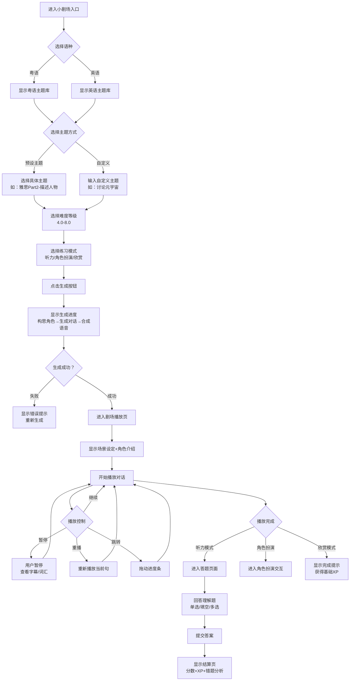
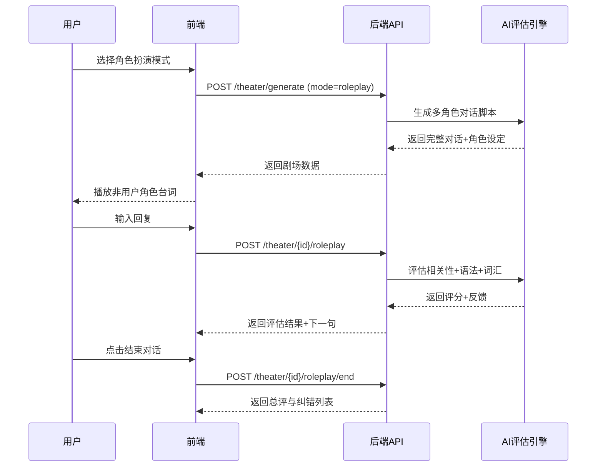
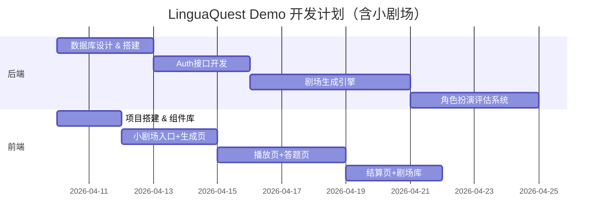

# LinguaQuest 产品需求文档（PRD）

> 版本：v1.1（补全版）  
> 更新时间：2026-04-08  
> 适用范围：Demo / MVP 阶段

---

## 1. 产品背景与目标

### 1.1 项目背景

现有语言学习产品普遍存在以下问题：

- 学习内容静态，难以根据用户兴趣动态生成
- 听说训练割裂，缺少真实场景中的连续对话体验
- 反馈链路弱，用户完成练习后不知道“哪里错、如何改”

LinguaQuest 以“AI 小剧场”为核心，通过多角色情景对话把“输入（听）+输出（说/写）+反馈（评估）”闭环打通，提升学习沉浸感和复练率。

### 1.2 产品愿景

打造“像玩剧情游戏一样练语言”的跨平台学习体验，让用户在可控难度的场景中持续获得成就感与进步反馈。

### 1.3 阶段目标（Demo / MVP）

- 支持 **粤语、英语** 两个语种
- 支持 **听力理解、角色扮演、欣赏模式** 三种练习形态
- 小剧场生成平均耗时 ≤ 30 秒
- 形成完整学习闭环：选题 → 生成 → 播放 → 练习/评估 → 结算复盘

---

## 2. 用户与使用场景

### 2.1 目标用户

1. **备考型用户（IELTS 4.0-8.0）**
   - 关注真实语境、听力理解与表达地道性
2. **兴趣提升型用户**
   - 偏好生活化主题（餐厅、出行、职场）
3. **碎片时间学习者**
   - 希望 5-10 分钟完成一次高密度训练

### 2.2 核心使用场景

- 通勤时完成一次“听力理解模式”
- 课后进行“角色扮演模式”强化输出
- 睡前使用“欣赏模式”进行输入沉浸

### 2.3 用户价值主张

- 学习内容由用户主题驱动（而非固定课件）
- 一次练习覆盖听懂、答题、纠错、建议
- 可反复练习同一剧场，追踪分数与成长

---

## 3. 范围定义

### 3.1 本期范围（In Scope）

- 账号体系：注册、登录、基础资料
- 小剧场：生成、播放、收藏、重练、分享链接
- 题目系统：单选/多选/填空
- 角色扮演：轮次互动、即时评分、总结报告
- 学习记录：我的剧场库、分数与XP记录

### 3.2 非本期范围（Out of Scope）

- 实时语音识别评分（ASR深度打分）
- 班级/教师管理后台
- 社区发帖与UGC审核系统
- 多语言扩展（日语/韩语等）

---

## 4. 信息架构与核心功能

### 4.1 信息架构

- 首页 / 地图页
- 小剧场入口
  - 语种选择
  - 主题选择（预设/自定义）
  - 难度选择
  - 模式选择
- 剧场播放页
- 答题页 / 角色扮演页
- 结算页
- 我的剧场库
- 个人中心

### 4.2 功能模块需求

#### 4.2.1 账号与身份

- 邮箱注册登录
- JWT 鉴权与会话续期
- 基础资料：昵称、头像、学习语种偏好

#### 4.2.2 小剧场生成

输入参数：

- language（粤语/英语）
- topic（预设或自定义）
- difficulty（4.0-8.0）
- mode（听力/角色扮演/欣赏）

输出结果：

- 场景设定
- 多角色对话脚本
- 对应语音资源
- 题目（听力模式）

失败兜底：

- 生成失败提示
- 一键重试
- 退化模板（缓存主题）

#### 4.2.3 剧场播放与交互

- 按句播放、暂停、重播、跳转
- 字幕开关、倍速控制、词汇点读
- 角色信息查看、收藏、分享

#### 4.2.4 答题与结算

- 题型：单选、多选、填空
- 提交后返回：分数、用时、错题解析、AI建议
- 发放 XP，记录练习历史

#### 4.2.5 角色扮演评估

- 用户选择扮演角色
- 系统按轮次推进对话
- 用户每轮输入后给出即时反馈
- 结束时生成总评（相关性/自然度/词汇）

#### 4.2.6 剧场库与复练

- 按语种、难度、状态筛选
- 查看历史最高分与完成次数
- 支持继续练习 / 再次练习 / 删除

---

## 5. 界面与交互设计规范

### 5.1 设计原则

- 游戏化轻量视觉：明亮、反馈明确、低学习成本
- 关键状态可视化：生成中/播放中/已完成
- 统一语种主题色：粤语偏暖、英语偏冷
- 移动优先，桌面增强

### 5.2 关键页面（补全）

#### 5.2.1 小剧场入口页

**目标：** 在最少步骤内完成“语种+主题+难度+模式”选择。

**核心组件：**

- 语种切换 Tab（粤语 / 英语）
- 主题区（预设卡片 + 自定义输入框）
- 难度滑杆（4.0-8.0）
- 模式单选（听力 / 角色扮演 / 欣赏）
- CTA 按钮：`生成我的小剧场`

**交互要求：**

- 未选模式时禁用生成按钮
- 自定义主题输入长度限制 2-60 字
- 点击生成后进入进度页并保留参数快照

#### 5.2.2 小剧场生成进度页

**目标：** 降低等待焦虑，提供可感知进度。

**状态分段：**

1. 构思角色设定（0%-30%）
2. 生成对话内容（31%-70%）
3. 合成语音资源（71%-100%）

**异常处理：**

- 超时（>45秒）：展示“稍慢但仍在生成”并允许后台继续
- 失败：展示错误码 + 重试按钮 + 返回入口

#### 5.2.3 剧场播放页

**布局结构：**
```
┌─────────────────────────────────────────┐
│  ← 返回  讨论香港茶餐厅文化  ⭐收藏      │
│  难度：雅思5.5 | 模式：听力理解          │
├─────────────────────────────────────────┤
│  📍 场景：香港旺角茶餐厅，午餐时间       │
│                                          │
│  👤 角色介绍                             │
│  ┌──────┐  ┌──────┐                    │
│  │ 阿明 │  │ 小美 │                    │
│  │ 本地 │  │ 游客 │                    │
│  └──────┘  └──────┘                    │
│                                          │
│  🎬 对话场景                             │
│  ┌─────────────────────────────────┐   │
│  │ [阿明头像] 🔊                    │   │
│  │ 小美，你第一次嚟香港茶餐厅啊？   │   │
│  │ [播放中动画波纹]                 │   │
│  └─────────────────────────────────┘   │
│                                          │
│  ⏮️ ⏯️ ⏭️  [进度条 ▓▓▓▓░░░░] 2:34/8:12 │
│  🔄 循环  🎚️ 0.8x  📝 显示字幕          │
│  📖 重点词汇：快靓正 / 茶餐厅            │
│                                          │
│  [继续答题 →]                            │
└─────────────────────────────────────────┘
```

#### 5.2.4 答题页面

- 支持单选、多选、填空
- 顶部显示题号与进度
- 提交前可返回修改

#### 5.2.5 结算页面

- 展示分数、XP、错题解析、AI建议
- 提供“重新练习 / 返回剧场库 / 分享成绩”

#### 5.2.6 我的剧场库页面

- 列表展示主题、难度、完成状态、历史成绩
- 多维筛选：语种 / 难度 / 状态

### 5.3 角色形象设计规范

#### 5.3.1 角色视觉风格

- 扁平化插画风格，2.5D轻微立体感
- 大头身比例（头:身 = 1:1.5），萌化可爱
- 表情丰富，至少3种情绪状态（开心/思考/惊讶）
- 配色与语种主色呼应

#### 5.3.2 核心角色设定

| 角色名 | 语种 | 形象描述 | 配色 | 性格标签 |
|:---|:---|:---|:---|:---|
| **阿珍 (Zhen)** | 粤语 | 短发港风女生，虎牙，穿浅橙色T恤+牛仔裤 | 珊瑚橙 `#FF7B54` | 活泼、热情、地道 |
| **Leo** | 英语 | 卷发少年，戴眼镜，蓝色运动风卫衣 | 天空蓝 `#4BABF5` | 友善、耐心、博学 |
| **阿明 (Ming)** | 粤语 | 平头本地青年，休闲衬衫，手持奶茶 | 暖黄 `#FFD23F` | 幽默、接地气 |
| **小美 (Mei)** | 粤语 | 长发女生，背包客装扮，好奇表情 | 薄荷绿 `#A8E6CF` | 好奇、好学 |
| **Sarah** | 英语 | 职业女性，西装，自信笑容 | 紫罗兰 `#A78BFA` | 专业、果断 |
| **Mike** | 英语 | 工程师，格子衬衫，思考手势 | 深蓝 `#3B82F6` | 理性、谨慎 |

---

## 6. 用户交互流程

### 6.1 小剧场完整流程图



### 6.2 角色扮演模式详细流程



---

## 7. 成功指标（更新）

### 北极星指标

> **每周小剧场生成数（Weekly Theater Creations）**

### 一级指标

| 指标 | 定义 | 目标值（T+6月） |
|:---|:---|:---|
| **小剧场日活占比** | 使用小剧场的DAU / 总DAU | ≥ **40%** |
| **小剧场完成率** | 生成后完成练习的比例 | ≥ **65%** |
| **自定义主题占比** | 自定义主题 / 总生成数 | ≥ **30%** |
| **角色扮演使用率** | 选择角色扮演模式的比例 | ≥ **25%** |
| **小剧场平均分** | 用户答题平均得分 | ≥ **75分** |

### 二级指标

| 指标 | 定义 | 目标值 |
|:---|:---|:---|
| **生成成功率** | 成功生成 / 总请求数 | ≥ **95%** |
| **生成耗时** | 从点击生成到完成的平均时间 | ≤ **30秒** |
| **重复练习率** | 同一剧场练习≥2次的比例 | ≥ **20%** |
| **收藏率** | 收藏剧场 / 完成剧场 | ≥ **15%** |
| **分享率** | 分享剧场 / 完成剧场 | ≥ **5%** |

---

## 8. Demo内容清单（更新）

### 预设小剧场主题（每语种）

#### 粤语主题（20个）

| 分类 | 主题 | 难度范围 |
|:---|:---|:---|
| 雅思Part 2 | 描述一个你尊敬的人 | 5.0-8.0 |
| 日常交流 | 茶餐厅叫餐 | 4.0-6.0 |
| 日常交流 | 搭地铁问路 | 4.0-5.5 |
| 职场商务 | 见工面试 | 5.5-7.5 |
| 演讲 | 介绍香港文化 | 6.5-8.0 |

#### 英语主题（20个）

| 分类 | 主题 | 难度范围 |
|:---|:---|:---|
| IELTS Part 2 | Describe a person you admire | 5.0-8.0 |
| Daily Talk | Ordering at a coffee shop | 4.0-6.0 |
| Daily Talk | Asking for directions | 4.0-5.5 |
| Workplace | Job interview | 5.5-7.5 |
| Current Affairs | Discussing climate change | 6.5-8.0 |

---

## 9. 开发里程碑（更新）


