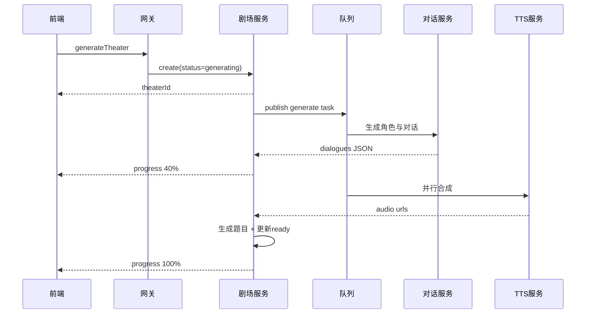

# 【技术方案文档】LinguaQuest 语言学习平台（TDD）

> 版本：v1.1（对齐 PRD 补全版）  
> 更新时间：2026-04-08  
> 对齐文档：`demand/PRD.MD`

---

## 1. 项目概述

LinguaQuest 是一款跨平台（Windows/macOS/Android）的游戏化语言学习应用，核心功能为“AI 小剧场”。用户输入语种、主题、难度与模式后，系统在 30 秒内生成多角色对话、语音与练习题，并提供评估与复盘。

**本阶段目标：**

- 实现三端统一体验（Tauri 2）
- 支持粤语/英语两语种
- 支持听力理解/角色扮演/欣赏三模式
- 完成学习闭环：生成 → 播放 → 练习 → 评估 → 复练

---

## 2. 技术可行性与约束

### 2.1 可行性结论

整体技术可行，关键依赖均有成熟实现路径：

- Tauri 2 支持桌面与移动端统一壳
- LLM + TTS 可实现动态内容生成
- Go + Redis + MQ 可承载异步生成链路
- Cloudflare R2 + CDN 可支撑音频分发

### 2.2 关键技术约束

- 小剧场端到端生成耗时目标：平均 ≤ 30s，P95 ≤ 45s
- 生成成功率目标：≥ 95%
- 角色扮演评估响应目标：单轮 ≤ 3s

### 2.3 风险与预案

1. **TTS 延迟偏高** → 并行合成 + 热门主题缓存
2. **LLM 输出结构不稳定** → JSON Schema 校验 + 重试/回退模板
3. **低端设备动画卡顿** → 降级渲染（CSS/SVG 替代 WebGL）

---

## 3. 总体架构设计

采用“前后端分离 + 异步任务驱动”架构：

- 客户端：React + TypeScript（运行于 Tauri WebView）
- 网关层：GraphQL API（Go）
- 业务服务：用户服务、剧场服务、进度服务
- AI 服务：对话生成、语音合成、评估
- 数据层：MySQL、Redis、RabbitMQ、R2

```mermaid
graph TB
    subgraph Client
      App[Tauri App]\n      FE[React + TS]
    end

    subgraph Backend
      GW[GraphQL Gateway]
      US[User Service]
      TS[Theater Service]
      PS[Progress Service]
    end

    subgraph AI
      LLM[Dialogue Generation]
      TTS[Speech Synthesis]
      EVAL[Roleplay Evaluation]
    end

    subgraph Infra
      DB[(MySQL)]
      RD[(Redis)]
      MQ[(RabbitMQ)]
      R2[(Cloudflare R2)]
      CDN[CDN]
    end

    App --> FE --> GW
    GW --> US
    GW --> TS
    GW --> PS

    TS --> MQ --> LLM
    TS --> MQ --> TTS
    TS --> EVAL

    US --> DB
    TS --> DB
    PS --> DB
    US --> RD
    TS --> RD

    TTS --> R2 --> CDN
    FE --> CDN
```

---

## 4. 技术选型

### 4.1 前端

| 领域 | 选型 | 说明 |
|:---|:---|:---|
| 跨平台壳 | Tauri 2 | 轻量、安全、可扩展 |
| UI | React 18 + TypeScript | 生态成熟，类型安全 |
| 状态管理 | Zustand | 轻量，低心智负担 |
| 动画 | Framer Motion | 复杂交互与过渡动画 |
| 音频 | Howler.js | 播放控制与兼容性好 |
| 数据层 | Apollo Client | GraphQL 缓存与状态统一 |

### 4.2 后端

| 领域 | 选型 | 说明 |
|:---|:---|:---|
| 主语言 | Go 1.22+ | 并发强，部署简单 |
| API 协议 | GraphQL (gqlgen) | 前端按需查询 |
| 数据库 | MySQL 8.0 | 关系数据稳定可靠 |
| 缓存 | Redis 7 | 会话与热点数据 |
| 队列 | RabbitMQ | 异步任务可靠投递 |
| 对象存储 | Cloudflare R2 | 低成本 S3 兼容 |

### 4.3 AI 服务

| 能力 | 选型建议 | 说明 |
|:---|:---|:---|
| 对话生成 | GPT/Claude 类模型 | 多轮语境与角色控制 |
| TTS | Azure/ElevenLabs/本地可替换 | 粤语与英语音色支持 |
| 文本评估 | LLM + 规则混合 | 相关性/自然度/词汇分项 |

---

## 5. 数据模型设计

### 5.1 核心实体

- User（用户）
- Theater（剧场）
- TheaterDialogue（台词）
- PracticeRecord（练习记录）
- RoleplayTurn（角色扮演轮次）
- XPTransaction（XP流水）

### 5.2 关键表结构（节选）

```sql
CREATE TABLE users (
  id BIGINT PRIMARY KEY AUTO_INCREMENT,
  email VARCHAR(255) UNIQUE NOT NULL,
  password_hash VARCHAR(255) NOT NULL,
  nickname VARCHAR(64),
  avatar_url VARCHAR(500),
  preferred_language ENUM('cantonese','english') DEFAULT 'english',
  total_xp INT NOT NULL DEFAULT 0,
  created_at TIMESTAMP DEFAULT CURRENT_TIMESTAMP
);

CREATE TABLE theaters (
  id BIGINT PRIMARY KEY AUTO_INCREMENT,
  user_id BIGINT NOT NULL,
  language ENUM('cantonese','english') NOT NULL,
  topic VARCHAR(200) NOT NULL,
  difficulty DECIMAL(2,1) NOT NULL,
  mode ENUM('listening','roleplay','appreciation') NOT NULL,
  scene_description TEXT,
  status ENUM('generating','ready','failed') DEFAULT 'generating',
  is_custom_topic TINYINT(1) DEFAULT 0,
  created_at TIMESTAMP DEFAULT CURRENT_TIMESTAMP,
  INDEX idx_user_created (user_id, created_at),
  INDEX idx_status (status)
);

CREATE TABLE practice_records (
  id BIGINT PRIMARY KEY AUTO_INCREMENT,
  user_id BIGINT NOT NULL,
  theater_id BIGINT NOT NULL,
  score INT,
  duration_seconds INT,
  xp_earned INT,
  answer_payload JSON,
  completed_at TIMESTAMP DEFAULT CURRENT_TIMESTAMP,
  INDEX idx_user_theater (user_id, theater_id)
);
```

---

## 6. API 设计（对齐 PRD）

### 6.1 GraphQL 核心 Schema（节选）

```graphql
enum Language { CANTONESE ENGLISH }
enum Mode { LISTENING ROLEPLAY APPRECIATION }
enum TheaterStatus { GENERATING READY FAILED }

type Theater {
  id: ID!
  language: Language!
  topic: String!
  difficulty: Float!
  mode: Mode!
  sceneDescription: String
  status: TheaterStatus!
  createdAt: String!
}

type PracticeResult {
  score: Int!
  xpEarned: Int!
  accuracy: Float!
  feedback: String!
}

type Mutation {
  generateTheater(input: GenerateTheaterInput!): Theater!
  retryGenerateTheater(theaterId: ID!): Theater!
  submitAnswers(theaterId: ID!, answers: [AnswerInput!]!): PracticeResult!
  submitRoleplayTurn(theaterId: ID!, text: String!): RoleplayTurnResult!
  finishRoleplay(theaterId: ID!): RoleplayReport!
}
```

### 6.2 关键接口语义

- `generateTheater`：创建任务并立即返回 `GENERATING`
- WebSocket/SSE：推送生成进度（0-100）与阶段文案
- `submitAnswers`：返回分数、错题解析摘要、XP
- `submitRoleplayTurn`：返回单轮评分与建议

---

## 7. 关键流程实现

### 7.1 小剧场生成流程



### 7.2 角色扮演评估流程

- 输入：场景、最近 N 轮上下文、用户当前回复
- 评估维度：
  - 相关性（0-40）
  - 自然度（0-30）
  - 词汇表达（0-30）
- 输出：总分、纠错建议、替代表达

---

## 8. 非功能需求与SLO

### 8.1 性能

- 首屏 FCP < 1.5s（缓存命中场景）
- 生成任务平均耗时 ≤ 30s
- 关键页面交互帧率目标：60fps

### 8.2 稳定性

- API 可用性：99.9%（月）
- 生成任务失败自动重试：最多 2 次
- 超时任务落盘并支持恢复查询

### 8.3 安全

- JWT + Refresh Token 轮换
- 密码 `bcrypt` 哈希
- 签名 URL 访问音频（默认 1h 失效）
- 速率限制（IP + 用户维度）

---

## 9. 观测与埋点

### 9.1 事件埋点

- `theater_generate_click`
- `theater_generate_success`
- `theater_generate_failed`
- `theater_play_complete`
- `practice_submit`
- `roleplay_turn_submit`
- `theater_retry`
- `theater_share_click`

### 9.2 关键监控

- 生成耗时分布（P50/P95）
- LLM/TTS 调用错误率
- 队列积压长度
- 单用户日生成次数与成功率

---

## 10. 测试方案

### 10.1 测试分层

- 单元测试：服务层、评分算法、参数校验
- 集成测试：生成链路（LLM/TTS Mock）
- E2E：入口页 → 生成 → 播放 → 答题/角色扮演 → 结算

### 10.2 验收标准（与 PRD 对齐）

1. 三种模式均可完整走通
2. 剧场库可筛选、复练与查看历史记录
3. 结算页输出分数/XP/建议
4. 生成成功率达到 95% 目标（压测样本）

---

## 11. 里程碑与交付

### 11.1 开发阶段

- Phase 1：基础框架与账号体系（1周）
- Phase 2：剧场生成链路（2周）
- Phase 3：播放/答题/结算（2周）
- Phase 4：角色扮演评估（1.5周）
- Phase 5：优化与上线准备（1周）

### 11.2 交付物

- 前后端可运行代码
- GraphQL 文档与接口测试集合
- 数据库迁移脚本
- 监控面板与告警规则
- 本 TDD 与 PRD 对齐版本

---

## 12. 后续扩展

- 引入语音输入与口语评分（ASR）
- 多语言扩展（日语/韩语）
- 个性化学习路径推荐
- 社交化挑战与排行榜
